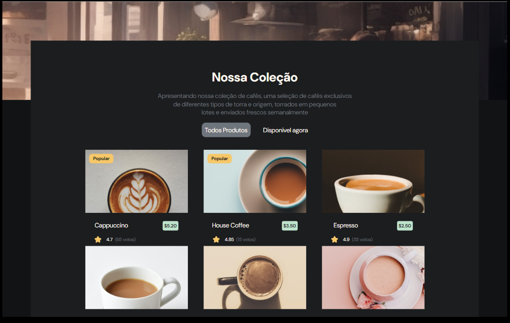
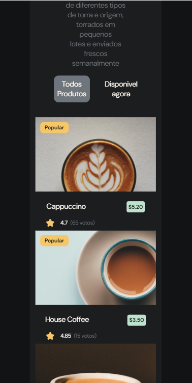

# Simple Coffee
Este projeto é uma página web simples dedicada ao café, criada por mim e inspirada no layout do site *devChallenges.io*.

 

## Uso
Clone o projeto utilizando o comando git clone e, dentro do diretório do projeto, execute npm install para instalar as dependências necessárias

## Detalhes
* Versão desktop

---

* Versão mobile

